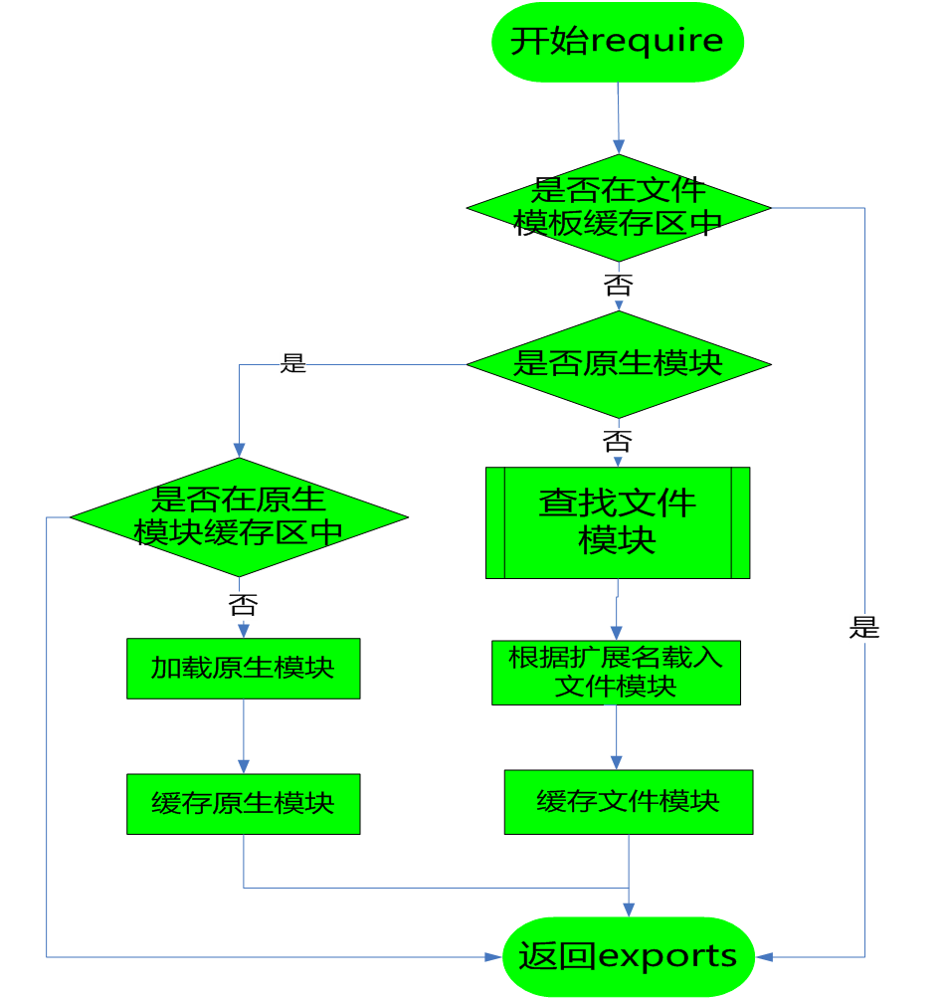
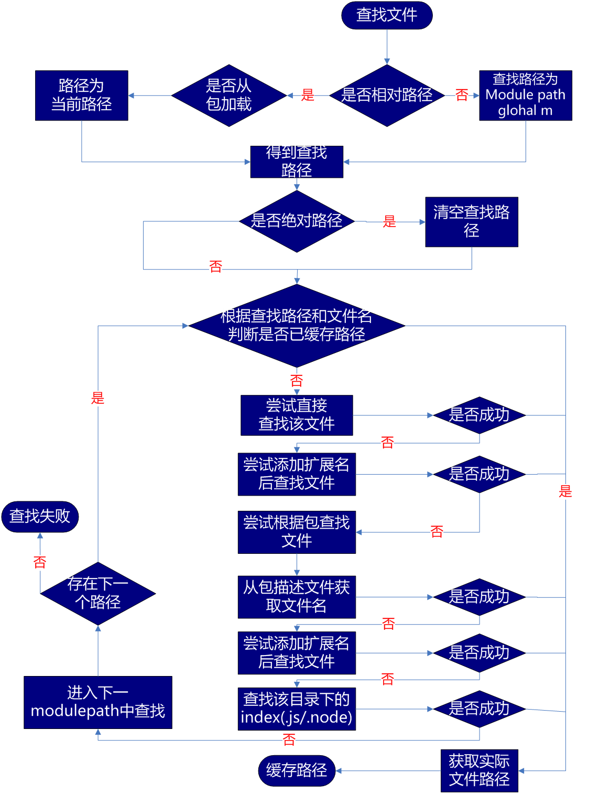

## 1. JS 模块化方面的不足

- JS 没有模块系统，不支持封闭的作用域和依赖管理
- 没有标准库，没有文件系统和 IO 流 API
- 也没有包管理系统

## 2.CommonJS 规范

- 封装功能
- 封闭作用域
- 可能解决依赖问题
- 工作效率更高，重构方便

## 3.Node 中的 CommonJS

- 在 node.js 里，模块划分所有的功能，每个 JS 都是一个模块
- 实现 require 方法，NPM 实现了模块的自动加载和安装依赖

```js
(function (exports, require, module, __filename, __dirname) {
  exports = module.exports = {};
  exports.name = "zfpx";
  exports = { name: "zfpx" };
  return module.exports;
});
```

## 4.模块分类

### 4.1 原生模块

`http` `path` `fs` `util` `events` 编译成二进制，加载速度最快，原来模块通过名称来加载

### 4.2 文件模块

在硬盘的某个位置，加载速度非常慢，文件模块通过名称或路径来加载文件模块的后缀有三种

- 后缀名为.js 的 JavaScript 脚本文件，需要先读入内存再运行
- 后缀名为.json 的 JSON 文件，fs 读入内存 转化成 JSON 对象
- 后缀名为.node 的经过编译后的二进制 C/C++扩展模块文件，可以直接使用

> 一般自己写的通过路径来加载，别人写的通过名称去当前目录或全局的 node_modules 下面去找

### 4.3 第三方模块

- 如果 require 函数只指定名称则视为从`node_modules`文件夹下面加载文件，这样的话你可以移动模块而不需要修改引用的模块路径
- 第三方模块的查询路径包括 `module.paths` 和全局目录

#### 4.3.1 全局目录

window 如果在环境变量中设置了`NODE_PATH`变量，并将变量设置为一个有效的磁盘目录，require 在本地找不到此模块时向在此目录下找这个模块。UNIX 操作系统中会从 `$HOME/.node_modules` `$HOME/.node_libraries`目录下寻找

### 4.4 模块的加载策略



### 4.5 文件模块查找规则



## 5.从模块外部访问模块内的成员

- 使用 exports 对象
- 使用 module.exports 导出引用类型

## 6.模块对象的属性

- module.id
- module.filename
- module.loaded
- module.parent
- module.children
- module.paths

## 7.包

在 Node.js 中，可以通过包来对一组具有相互依赖关系的模块进行统一管理，通过包可以把某个独立功能封装起来，每个项目的根目录下面，一般都有一个 package.json 文件，定义了这个项目所需要的各种模块，以及项目的配置信息（比如名称、版本、许可证等元数据）。npm install 命令根据这个配置文件，自动下载所需的模块，也就是配置项目所需的运行和开发环境。

| 项目                | 描述                             |
| ------------------- | -------------------------------- |
| name                | 项目名称                         |
| version             | 版本号                           |
| description         | 项目描述                         |
| keywords: {Array}   | 关键词，便于用户搜索到我们的项目 |
| homepage            | 项目 url 主页                    |
| bugs                | 项目问题反馈的 Url 或 email 配置 |
| license             | 项目许可证                       |
| author,contributors | 作者和贡献者                     |
| main                | 主文件                           |
| bin                 | 项目用到的可执行文件配置         |
| repository          | 项目代码存放地方                 |
| scripts             | 声明一系列 npm 脚本指令          |
| dependencies        | 项目在生产环境中依赖的包         |
| devDependencies     | 项目在开发环境中依赖的包         |
| peerDependencies    | 应用运行依赖的宿主包             |

[package.json](https://docs.npmjs.com/files/package.json)
[packagejson](http://javascript.ruanyifeng.com/nodejs/packagejson.html)

## 8.NPM

- 安装完 node 之后只能使用 Node 语言特性及核心函数，我们还需要一个系统来下载、安装和管理第三方模块
- 在 Node 里这个系统被称为 Node 包管理器（Node Package Manager, NPM）

### 8.1 npm 提供的功能

- 公共注册服务，用户可以把自己写的包上传到服务器上
- 命令行下载工具，用户可以通过 npm 命令把别人写的包下载到自己电脑上，还可以管理自己模块依赖的其他模块

搜索第三方包的地址

```
https://www.npmjs.com/search
```

### 8.2 npm 命令

#### 8.2.1 (npm install)安装包

- 打开命令行或终端，进入要安装包的目录，然后执行以下命令安装依赖的模块

```
npm install <package-name>
npm i mime
```

> 此命令会从服务器上下载此模块到当前目录下的 node_modules 目录下，如果 node_modules 目录不存在则会创建一个

- 也可以安装特定的版本

```
npm install <package name>@<version spec>
npm i mime@2.1
```

- 还可以使用一个版本号范围来替换点位符

```
npm i mime@2.x
```

#### 8.2.2 卸载包

```
npm uninstall <package name>
```

#### 8.2.3 更新包

我们还可以通过以下指令更新已经安装的包

```
npm update <package name>
```

### 8.3 包的安装模式

#### 8.3.1 本地安装

- 默认情况下安装命令会把对应的包安装到当前目录下，这叫本地安装，如果包里有可执行的文件 NPM 会把可执行文件安装到 `./node_modules/.bin` 目录下
- 本地安装的模块只能在当前目录和当前目录的子目录里面使用

#### 8.3.2 全局安装

- 如果希望安装的包能够在计算机的所有目录下面都能使用，就需要全局安装

```
npm install <package-name> -g
npm install mime -g
C:\Users\zhufeng\AppData\Roaming\npm\node_modules\mime
```

- 在全局安装的模式下，npm 会把包安装到全局目录，通过此命令可以查看当前全局目录的位置

```
npm root -g
C:\Users\Administrator\AppData\Roaming\npm\node_modules
```

- 如果包里有可执行文件，会把可执行文件安装到此 node_modules 的上一级目录中。

```
C:\Users\Administrator\AppData\Roaming\npm
```

- 全局安装的一般是需要在任意目录下面执行的命令，比如 `babel`

```
npm install babel-cli -g
```

- 如果全局安装的命令不能用则可能是没有正确配置用户变量 `PATH`,需要在系统变量中为`PATH`变量添加全局安装目录

### 8.3 注册、登录和发布模块

1. 注册 npm 账号

[npmjs](https://www.npmjs.com/)

2. 登录

```
npm login
```

3.发布

```
npm publish
```

### 8.4 npx

- npm 从 5.2 版本开始，增加了 `npx` 命令

#### 8.4.1 调用项目安装的模块

- npx 想要解决的主要问题，就是调用项目内部安装的模块

```
npm install -D mocha
```

> 一般来说，调用 `mocha` 只能在 `package.json`的 scripts 字段里面使用

```json
"scripts": {
    "test": "mocha -version"
}
```

```
npx mocha --version
```

> npx 的原理很简单，就是运行的时候，会到 node_modules/.bin 路径和环境变量$PATH 里面，检查命令是否存在

#### 8.4.2 避免全局安装模块

- 除了调用项目内部模块，npx 还能避免全局安装的模块。比如，`create-react-app` 这个模块是全局安装，npx 可以运行它，而且不进行全局安装

```
$ npx create-react-app my-create-app
```

> 上面代码运行时，npx 将 create-react-app 下载到一个临时目录，使用以后再删除

#### 8.4.3 --no-install 参数和 --ignore-existing 参数

- 如果想让 npx 强制使用本地模块，不下载远程模块，可以使用 `--no-install` 参数。如果本地不存在该模块，就会报错
- 反过来，如果忽略本地的同名模块，强制安装使用远程模块，可以使用 `--ignore-existing` 参数

## 9.yarn

Yarn 是一个依赖管理工具。它能够管理你的代码，并与全世界的开发者分享代码。代码是通过包（有时也被称为模块）进行共享的。在每一个包中包含了所有需要共享的代码，另外还定义了一个 `package.json` 文件，用来描述这个包。

### 9.1 初始化一个新的项目

```
yarn init
```

### 9.2 添加一个依赖包

```
yarn add [package]
yarn add [package]@[version]
yarn add [package]@[tag]
```

### 9.3 更新一个依赖包

```
yarn upgrade [package]
yarn upgrade [package]@[version]
yarn upgrade [package]@[tag]
```

### 9.4 删除一个依赖包

```
yarn remove [package]
```

### 9.5 安装所有的依赖包

```
yarn
```

或者

```
yarn install
```

## 参考

- [yarn](https://yarn.bootcss.com/)

## 参考资料

- [npm 官方手册](https://docs.npmjs.com/getting-started/what-is-npm)
- [npm 总结](http://www.tuicool.com/articles/VB7nYn)
