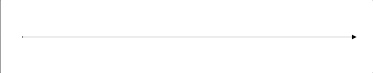
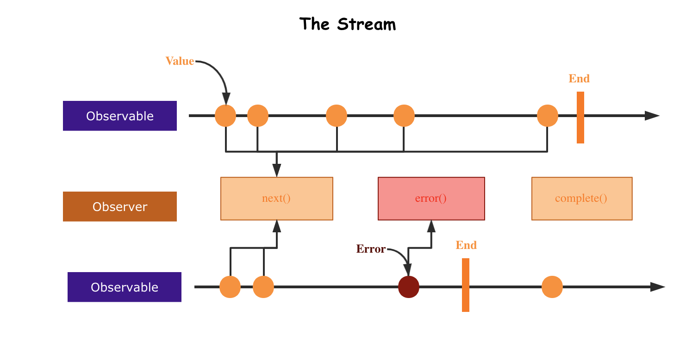
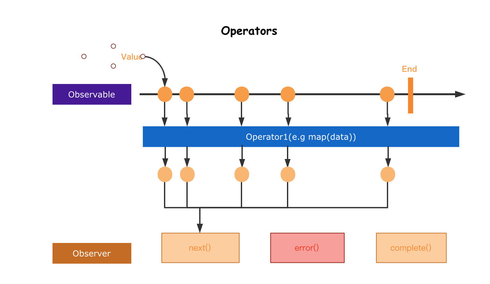
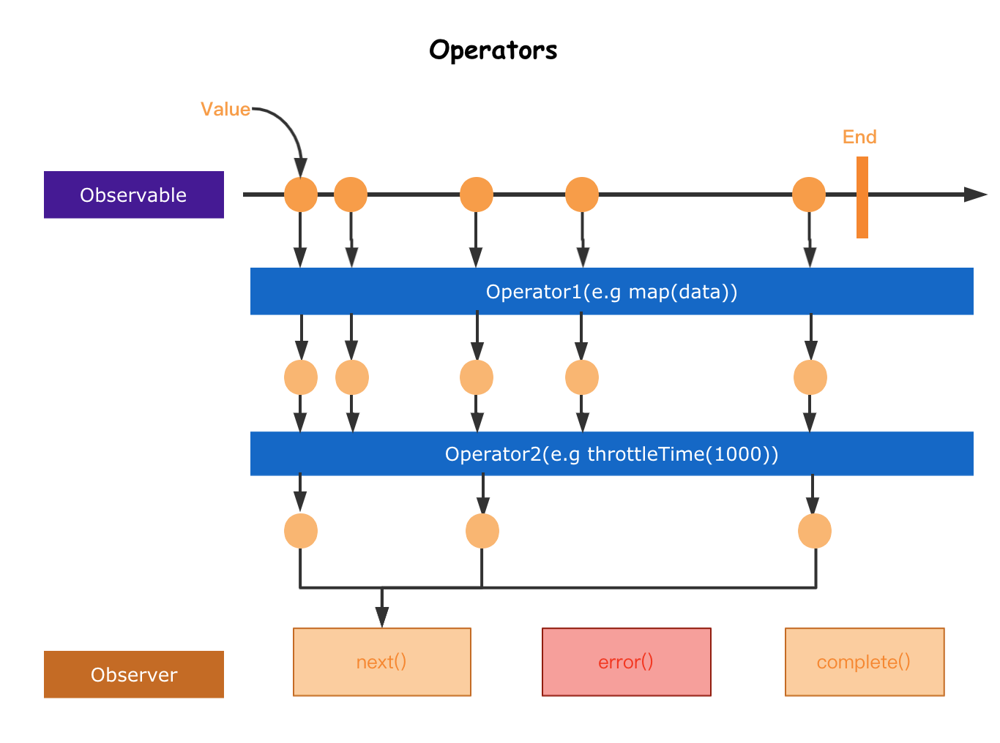

## 1.RxJS

### 1.1 RxJS 介绍

- `RxJS` 是一个使用可观察序列组合异步和基于事件的程序的库
- 它提供了一种核心类型，即`Observable`，以及卫星类型（`Observer`, `Schedulers`,`Subject`）和操作符，这些操作符受到`Array`方法(map, filter, reduce, every 等)的启发，可以将异步事件处理为集合
- `ReactiveX` 结合了观察者模式和迭代器模式，并将函数式编程与集合相结合，以满足对理想管理事件序列的需求

### 1.2 基本概念

- Observable 表示可调用的未来值或事件的集合的想法
- Observer 是一组回调，知道如何监听 Observable 传递的值
- Subscription 表示 `Observable`的执行，主要用于取消执行
- Operators 是纯函数，使用操作（如 `map`,`filter`,`concat`,`reduce`等）处理集合时具有函数式编程风格
- Subject 等同于 `EventEmitter`, 是将值或事件多播到多个`Observer`的唯一方法
- Schedulers 是集中式调度程序，用于控制开发，允许我们协调计算发生在例如 setTimeout、requestAnimationFrame 或其他位置的时间

### 1.3 参考链接

- [官方文档](https://rxjs.dev/)
- [入门指南](https://rxjs.dev/guide/overview)
- [例子](https://rxjs.dev/examples)
- [常见问题](https://rxjs.dev/faq)
- [中文文档](https://cn.rx.js.org/)
- [github 源码](https://github.com/ReactiveX/rxjs)
- [rxjs 弹珠图](https://rxmarbles.com/)
- [rxjs 可视化](https://rxviz.com/)
- [explorer](https://reactive.how/rxjs/explorer)

## 2.Observable

- `Observables(可观察对象)`是懒惰的多个值的`Push`集合，可观察对象是一种异步数据流，它可以在将来推送多个值。它们是`惰性`的，因为它们不会立即开始发送值，直到有人订阅它们

### 2.1 Pull 和 Push

- `Pull`和`Push`是两种不同的协议，用于描述数据生产者如何与数据消费者进行通信
- 在`Pull`系统中，消费者决定何时从数据生产者接收数据。生产者本身并不知道何时将数据传递给消费者
- 每个 `JavaScript` 函数都是 `Pull` 系统。函数是数据的生产者，而调用函数的代码通过`拉出`单个返回值从其调用中消费它

```js
function* generator() {
  yield 1;
  yield 2;
  yield 3;
}
const iterator = generator();
console.log(iterator.next().value); // 1
console.log(iterator.next().value); // 2
console.log(iterator.next().value); // 3
```

- 在 `Push` 系统中，生产者决定何时将数据发送给消费者。消费者不知道何时会收到该数据
- `Promise`是 JavaScript 中最常见的推送系统。`Promise`向已注册的回调函数(Consumers)提供已解析的值
- `RxJS`引入了可观察对象，这是一种新的 JavaScript 推送系统。可观察对象是多个值的生产者，将他们`推送`到`观察者(Consumers)`

```js
button.addEventListner("click", function () {
  console.log("Button was clicked!");
});
```

|      | 生产者                     | 消费者                     |
| ---- | -------------------------- | -------------------------- |
| Pull | 被动：在请求时生成数据     | 主动：决定何时请求数据     |
| Push | 主动：以自己的速度生成数据 | 被动：对收到的数据做出反应 |

### 2.2 Stream(流)

- 流是随着时间变化的值序列





### 2.3 Observable

- `Observer(观察者)`是由可观察对象传递的值的消费者。观察者仅仅是一组回调，每种类型的通知由可观察对象传递：`next`,`error`和`complete`
- 要使用 `Observer(观察者)`，请将其提供给可观察对象的 `subscribe`
- 观察者只是带有三个回调的对象，每种类型的通知都有一个回调，可观察对象可能传递这些通知
- `RxJS`中的观察者也可能是部分可选的。如果不提供其中一个回调，可观察对象的执行仍然会正常进行，但是某些类型的通知将被忽略，因为观察者中没有相应的回调
- 在订阅可观察对象时，您也可以将 `next` 回调作为参数提供，而不必附加到观察者对象上，在`observable.subscribe`内部，它将使用回调参数作为`next`处理程序创建观察者对象
- `调用`或`订阅`是一个隔离的操作：两次函数调用会触发两个单独的副作用，两次可观察对象订阅会触发两个单独的副作用。与`事件发射器（EventEmitters）`不同，事件发射器共享副作用并且无论是否存在订阅者都有急切执行，而可观察对象没有共享的执行并且是懒惰的
- `Observables`可以使用`new Observable`或创建操作符创建，使用观察者订阅，执行以向观察者发送`next`/`error`/`complete`通知，并且可以对其执行进行处理
- Observable 的核心关注点
  - 创建 `Observables`
  - 订阅 `Observables`
  - 执行 `Observables`
  - 处理 `Observables`

### 2.4 src\index.js

src\index.js

```js
import { Observable } from "./rxjs";
const observable = new Observable((subscriber) => {
  subscriber.next(1);
  subscriber.next(2);
  subscriber.next(3);
  subscriber.complete();
});
observable.subscribe({
  next: (value) => console.log("next value:", value),
  complete: () => {
    console.log("complete");
  },
});
observable.subscribe((value) => console.log("next value:", value));
```

### 2.5 rxjs\index.js

src\rxjs\index.js

```js
export { Observable } from "./internal/Observable";
```

### 2.6 Observable.js

src\rxjs\internal\Observable.js

```js
import { Subscriber } from "./Subscriber";

export class Observable {
  constructor(subscribe) {
    if (subscribe) {
      this._subscribe = subscribe;
    }
  }
  subscribe(observerOrNext) {
    const subscriber = new Subscriber(observerOrNext);
    this._subscribe(subscriber);
    return subscriber;
  }
}
```

### 2.7 Subscriber.js

src\rxjs\internal\Subscriber.js

```js
import { isFunction } from "./util/isFunction";

export class Subscriber {
  isStopped = false;
  constructor(observerOrNext) {
    let observer;
    if (isFunction(observerOrNext)) {
      observer = {
        next: observerOrNext,
      };
    } else {
      observer = observerOrNext;
    }
    this.destination = observer;
  }
  next(value) {
    if (!this.isStopped) {
      this.destination.next(value);
    }
  }
  complete() {
    if (!this.isStopped) {
      this.isStopped = true;
      this.destination.complete?.();
    }
  }
}
```

### 2.8 isFunction.js

src\rxjs\internal\util\isFunction

```js
export function isFunction(value) {
  return typeof value === "function";
}
```

## 3.of

- RxJS 的 `of` 操作符允许你创建一个 `Observable`, 它发出一组项目，然后完成
- 你可以使用它来将任何值发送到一个`Observable`中，例如，你可以使用它来将一个数字数组转换为`Observable`
- `of`操作符是同步的，意味着它会立即发出所有的值，并立即完成，如果你需要异步发出值，你可以使用 from 操作符
- RxJS 的`from`操作符允许你将多种不同的数据类型转换为 Observable,包括数组、类数组对象（如 arguments 对象）、迭代器和可观察对象
- `from`操作符是异步的，意味着它会在内部使用内置的调度

### 3.1 src\index.js

src\index.js

```js
import { of, from } from "./rxjs";
const arrayLike = of(1, 2, 3);
arrayLike.subscribe({
  next: (value) => console.log(`arrayLike:`, value),
  complete: () => console.log(`arrayLike done`),
});

const promiseLike = from(Promise.resolve(4));
promiseLike.subscribe({
  next: (value) => console.log(`promiseLike:`, value),
  complete: () => console.log(`promiseLike done`),
});
```

### 3.2 rxjs\index.js

src\rxjs\index.js

```js
export { Observable } from './internal/Observable';
+ export { of } from './internal/observable/of';
+ export { from } from './internal/observable/from';
```

### 3.3 of.js

src\rxjs\internal\observable\of.js

```js
import { from } from "./from";
export function of(...args) {
  return from(args);
}
```

### 3.4 from.js

src\rxjs\internal\observable\from.js

```js
import { innerFrom } from "./innerFrom";
export function from(input) {
  return innerFrom(input);
}
```

### 3.5 innerFrom.js

src\rxjs\internal\observable\innerFrom.js

```js
import { isArrayLike } from '../util/isArrayLike';
import { isPromise } from '../util/isPromise';

import { Observable } from '../Observable';
export function innerFrom(input) {
    if(input typeof Observable) {
        return input;
    }
    if(input != null) {
        if(isArrayLike(input)) {
            return fromArrayLike(input);
        }
        if(isPromise(input)) {
            return fromPromise(input);
        }
    }
}

export function fromArrayLike(array) {
    return new Observable(subscriber => {
        for(let i=0; i<array.length; i++) {
            subscriber.next(array[i]);
        }
        subscriber.complete();
    });
}

export function fromPromise(promise) {
    return new Observable(subscriber => {
        promise.then(value => {
            subscriber.next(value);
            subscriber.complete();
        });
    });
}
```

### 3.6 isArrayLike.js

src\rxjs\internal\util\isArrayLike.js

```js
export const isArrayLike = (x) =>
  x && typeof x.length === "number" && typeof x !== "function";
```

### 3.7 isPromise.js

src\rxjs\internal\util\isPromise.js

```js
import { isFunction } from "./isFunction";
export function isPromise(value) {
  return isFunction(value?.then);
}
```

## 4.fromEvent

- RxJS 的`fromEvent`函数允许你将浏览器事件转换为`Observable`。它接受两个参数：
  - 第一个参数是事件目标，例如 DOM 元素或`window`对象
  - 第二个参数是事件名称，例如 `click`或`scroll`

### 4.1 src\index.js

src\index.js

```js
import { fromEvent } from "./rxjs";
const source = fromEvent(document, "click");
const subscriber = source.subscribe(console.log);
setTimeout(() => {
  subscriber.unsubscribe();
}, 1000);
```

### 4.2 rxjs\index.js

```js
export { Observable } from "./internal/Observable";
export { of } from "./internal/observable/of";
export { from } from "./internal/observable/from";
+ export { fromEvent } from "./internal/observable/fromEvent"
```

### 4.3 fromEvent.js

src\rxjs\internal\observable\fromEvent.js

```js
export function fromEvent(target, eventName) {
  return new Observable((subscriber) => {
    const handler = (...args) => subscriber.next(...args);
    target.addEventListener(eventName, handler);
    return () => target.removeEventListener(eventName, handler);
  });
}
```

### 4.4 Subscriber.js

src\rxjs\internal\Subscriber.js

```js
import { isFunction } from './util/isFunction';
+ import { Subscription } from './Subscription';
+ export class Subscriber extends Subscription {
    isStopped = false;
    constructor(observerOrNext) {
        super();
        let observer;
        if(isFunction(observerOrNext)) {
            observer = {
                next: observerOrNext
            }
        } else {
            observer = observerOrNext
        }
        this.destination = observer;
    }
    next(value) {
        if(!this.isStopped) {
            this.destination.next(value);
        }
    }
    complete() {
        if(!this.isStopped) {
            this.isStopped = true;
            this.destination.complete?.();
        }
    }
}
```

### 4.5 Subscription.js

src\rxjs\internal\Subscription.js

```js
export class Subscription {
  _finalizers = [];
  unsubscribe() {
    const { _finalizers } = this;
    if (_finalizers) {
      for (const finalizer of _finalizers) {
        finalizer();
      }
    }
  }
  add(teardown) {
    this.finalizers.push(teardown);
  }
}
```

### 4.6 Observable.js

src\rxjs\internal\Observable.js

```js
import { Subscriber } from "./Subscriber";
export class Observable {
  constructor(subscribe) {
    if (subscribe) {
      this._subscribe = subscribe;
    }
  }
  subscribe(observerOrNext) {
    const subscriber = new Subscriber(observerOrNext);
+   const teardown = this._subscribe(subscriber);
+   subscriber.add(teardown);
    return subscriber;
  }
}
```

## 5.map&filter

- `map`操作符允许你对`Observable`中的每个值进行转换，并返回一个新的 `Observable`。它接受一个函数作为参数，该函数定义如何转换每个值。
- `filter` 操作符允许你选择性地过滤 `Observable`中的值。它接受一个函数作为参数，该函数定义如何过滤值





### 5.1 Operators

- 在 Rx 中 `Observable`,控制流的状态，是它的基石，但最有用的是它的 `operator`,`operator`允许复杂的异步代码以声明的方式进行轻松组合的基础单元。`operator`主要作用是操作、组合流中的数据

- 操作符是函数，它基于当前的 Observable 创建一个新的 Observable。这是一个无副作用的操作：前面的 Observable 保持不变
- 操作符本质上是一个纯函数(pure function),它接收一个 Observable 作为输入，并生成一个新的 Observable 作为输出。订阅输出 Observable 同样会订阅输入 Observable
- 操作符类型
  - Creation Operators 创建操作符，它们用于创建新的 Observable。这些操作符可以从各种不同的数据源（如数组、对象、Promise 等）创建 Observable,并可以控制 Observable 的行为（如发出值的频率、顺序等），像`of`,`from`,`timer`,`interval`和`fromEvent`等
  - Transformation Operators 转换操作符是 RxJS 中的一类特殊的操作符，它们用于将输入 Observable 转换为新的输出 Observable。这些操作符可以对输入 Observable 中的值进行转换、过滤、合并等操作，以便在输出 Observable 中呈现出所需的信息。像`map`等
  - Combination Operators 组合操作符用于将多个 `Observable` 合并成一个新的 `Observable`。这些操作符可以帮助你创建复杂的数据流，并控制他们之间的关系，像`merge`和`concat`等
  - Filtering Operators 过滤操作符用于过滤输入 Observable 中的值，只返回符合特定条件的值。这些操作符可以帮助你创建精确的数据流，并且非常实用。像`filter`等
  - Multicasting Operators 多播操作符用于将单个 `Observable` 共享给多个观察者 (Observer)。这些操作符可以帮助你控制 Observable 的行为，并有效地利用资源。像`share`等
- [rxmarbles](https://rxmarbles.com/)

### 5.2 src\index.js

src\index.js

```js
import { of, map, filter } from "./rxjs";
const subscriber = of(1, 2, 3)
  .pipe(map((val) => val * 2)) // [2,4,6]
  .pipe(filter((val) => val > 3)) // [4,6]
  .pipe(map((data) => data + 1)); // [5,7]
subscriber.subscribe(console.log);
```

### 5.3 rxjs\index.js

src\rxjs\index.js

```js
export { Observable } from './internal/Observable';
export { of } from './internal/observable/of';
export { from } from './internal/observable/from';
export { fromEvent } from './internal/observable/fromEvent';
+export { filter } from './internal/operators/filter';
+export { map } from './internal/operators/map';
```

### 5.4 Observable.js

src\rxjs\internal\Observable.js

```js
export class Observable {
  constructor(subscribe) {
    if (subscribe) {
      this._subscribe = subscribe;
    }
  }
  subscribe(observerOrNext) {
    const subscriber = new Subscriber(observerOrNext);
    const teardown = this._subscribe(subscriber);
    subscriber.add(teardown);
    return subscriber;
  }
+ pipe(operation) {
+   return operation(this);
+ }
}
```

### 5.5 map.js

src\rxjs\internal\operators\map.js

```js
import { Observable } from "../Observable";
export function map(project) {
  return (source) => {
    const observable = new Observable(function (subscriber) {
      return source.subscribe({
        ...subscriber,
        next: (value) => {
          subscriber.next(project(value));
        },
      });
    });
    return observable;
  };
}
```

### 5.6 filter.js

src\rxjs\internal\operators\filter.js

```js
import { Observable } from "../Observable";
export function filter(predicate) {
  return (source) => {
    const observable = new Observable(function (subscriber) {
      return source.subscribe({
        ...subscriber,
        next: (value) => {
          predicate(value) && subscriber.next(value);
        },
      });
    });
    return observable;
  };
}
```
